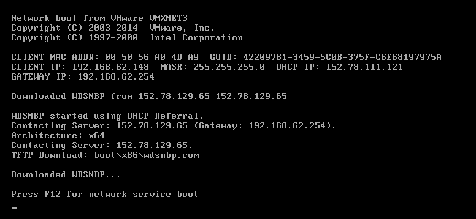
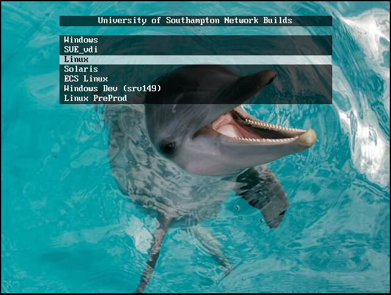
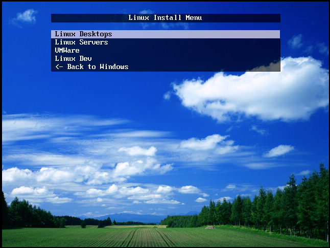
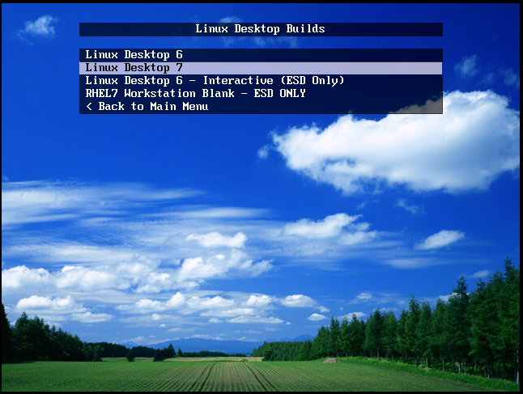
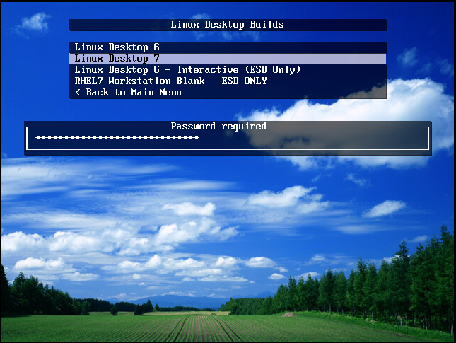
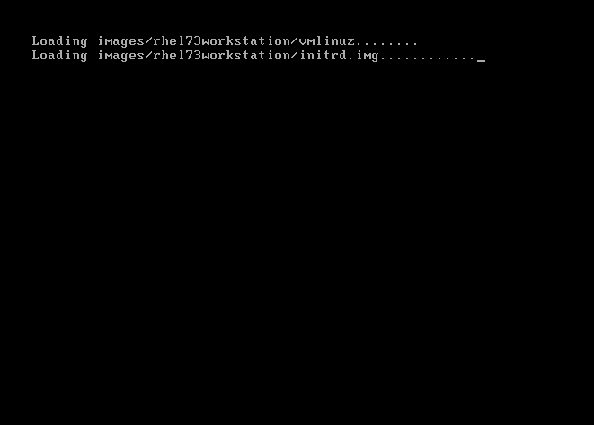
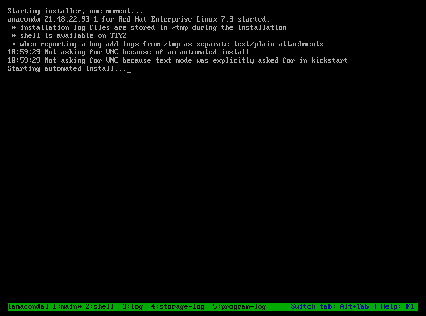

Installation
============

.. note::

   To install the University Linux Desktop system you need to be a member of 
   iSolutions staff (i.e. in the 'jfStaff' group). We are working on a way for
   anybody to install Linux desktops, but this is not yet available.

Before you begin
----------------

* Ensure that no USB hard drives or thumb drives are attached
* Ensure that no non-standard devices are attached by USB or otherwise
* Check for second or third hard drives. These should not be wiped, but if they contain data customers want, best practice is to disconnect them first.
* Make sure the PC is set to BIOS mode (not UEFI)
* Ensure Hybrid graphics are disabled, if offered

Start the installation
----------------------

Turn the computer on and select network boot (PXE boot) as it starts. When 
prompted, press F12 to start the network installation system:

The network build menu should then appear, choose Linux:

and then on the next menu choose Linux desktops:

Finally, choose Linux Desktop 7:

You will be prompted for the Linux build password:

If the build starts you'll see a loading screen like this one:

Followed by the Red Hat installer running automatically:

The installation will take between 10 and 20 minutes. During this time you 
don't need to watch the computer, its fully automatic.

University installer
--------------------

Once the Red Hat installer is finished the system will reboot and it will
display a message telling you that the University installer has started
and is ready to be used:

.. image:: img/install8.png

Press any key to start the installer and then enter the computer name if it
was not automatically detected:

.. image:: img/install9.png

You then need to enter your university username and password. The account must
be within the ``jfStaff`` group - so don't use ``adm`` accounts, use your 
normal account.:

.. image:: img/install10.png

The University installer will then complete all its tasks automatically 
without requiring any further input. It can take between 5 and 15 minutes
for this to finish, dependening on the speed of the hard drive:

.. image:: img/install11.png

Once complete the installer will show "all done" and you can restart to use
the new Linux desktop by pressing any key:

.. image:: img/install12.png

Post-installation tasks
-----------------------

Once the system has rebooted you might want to grant additional permissions
to the user for whom you built the workstation for. To do so, logon to the 
system and use :doc:`deskctl` to change :doc:`permissions`. Your account 
must be within the ``linuxadm`` or ``linuxsys`` Linux groups to do this. 
