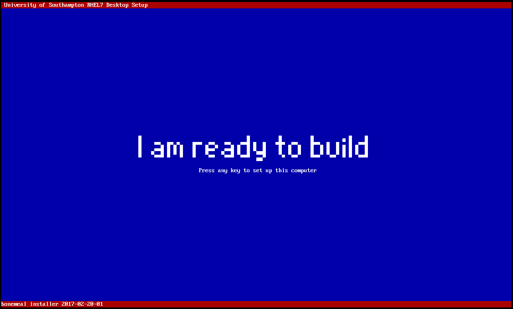
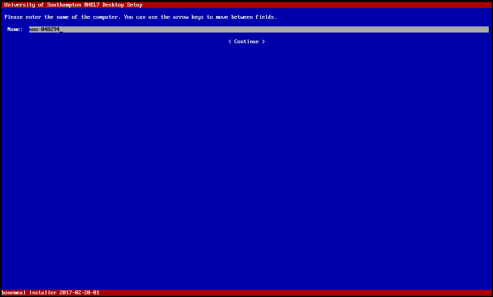
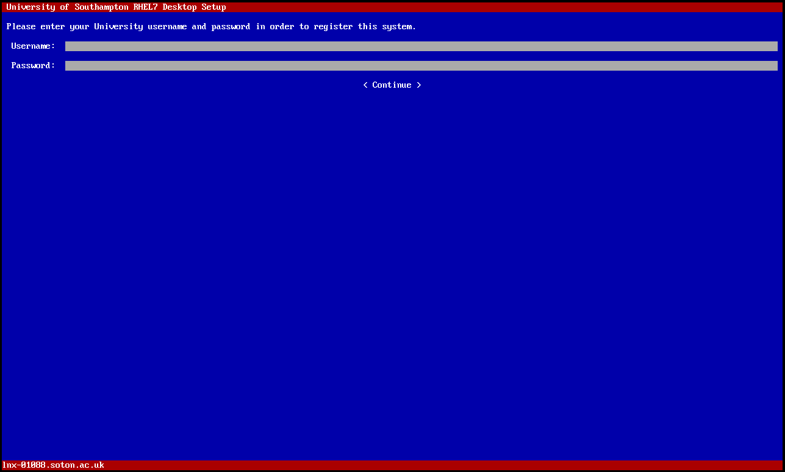
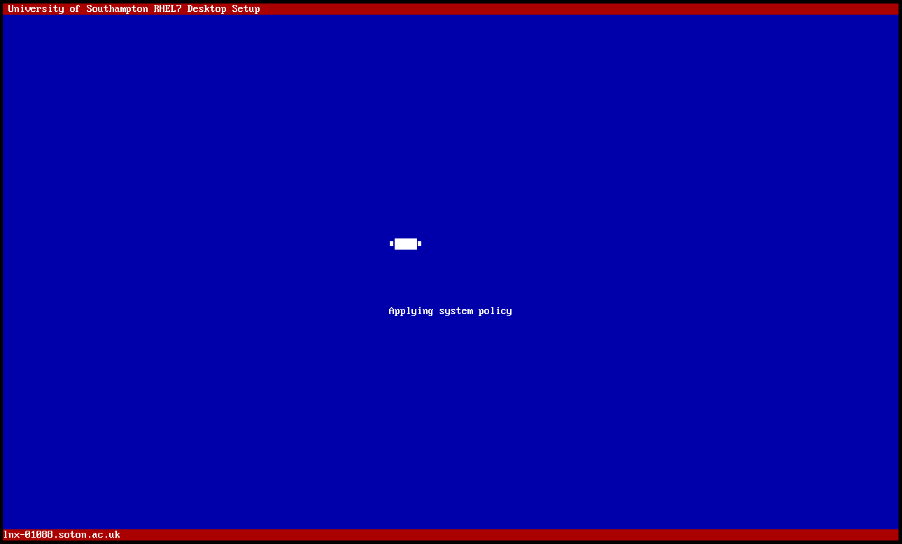
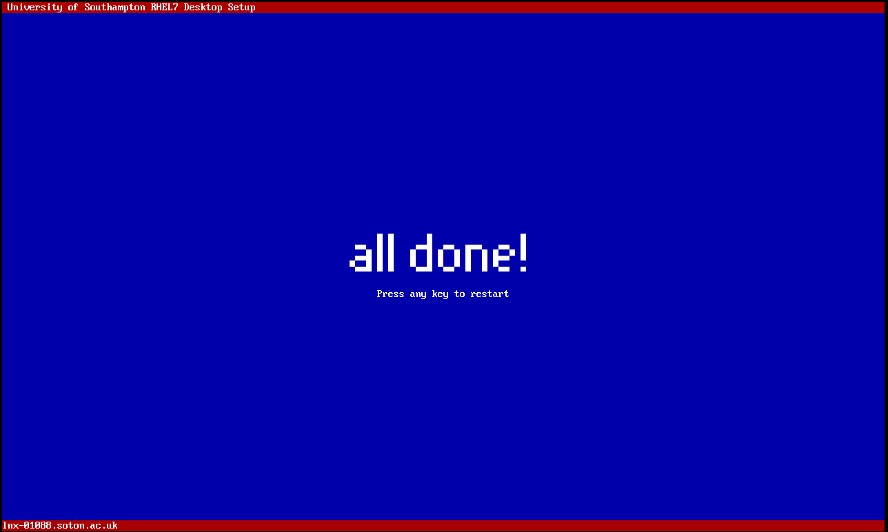

Migration Guide
===============

.. note::

   This guide is intended for iSolutions staff only.

Introduction
------------

This guide is intended to assist you migrating a customer's workstation from
either RHEL5 or RHEL6 to our current RHEL7 platform. Before you start, you 
should make sure that you have a USB disk with no data on it that you can use
to store data on the customer wishes to keep.

Migration outline
-----------------

- Check that the /home directory is being backed up
- Check for secondary hard drives in the system
- Disconnect any secondary hard drives 
- Check for non-backed up data in /local/scratch/
- Copy data from /local/scratch/ to the USB drive
- Install RHEL7
- Reconnect secondary hard drives
- Set up secondary hard drives to be automatically mounted
- Copy data back from the USB drive to /local/scratch/
- Copy home directory data back

Check backups are working
-------------------------

University installer
--------------------

Once the Red Hat installer is finished the system will reboot and it will
display a message telling you that the University installer has started
and is ready to be used:

Press any key to start the installer and then enter the computer name if it
was not automatically detected:

You then need to enter your university username and password. The account must
be within the ``jfStaff`` group - so don't use ``adm`` accounts, use your 
normal account.:

The University installer will then complete all its tasks automatically 
without requiring any further input. It can take between 5 and 15 minutes
for this to finish, dependening on the speed of the hard drive:

Once complete the installer will show "all done" and you can restart to use
the new Linux desktop by pressing any key:

Post-installation tasks
-----------------------

Once the system has rebooted you might want to grant additional permissions
to the user for whom you built the workstation for. To do so, logon to the 
system and use :doc:`deskctl` to change :doc:`permissions`. Your account 
must be within the ``linuxadm`` or ``linuxsys`` Linux groups to do this. 
